# PlantSense

**Automatic plant watering for Raspberry Pi.** PlantSense turns a Pi into a self-contained watering controller.
With a relay board and pumps or valves, it waters your plants from a schedule, live sensor data, or your own automations.

The pumps can be triggered three ways, mixed freely per pump:

- **By live sensor data** — Zigbee or Z-Wave soil moisture sensors (any mix), watering only when the soil is actually dry
- **By a fixed schedule** — any day(s) of the week, any time of day
- **From Home Assistant** (or anything else that can call a REST API) — for watering logic driven by weather, presence, or any other condition Home Assistant can see

Most off-the-shelf watering systems only offer the schedule, so you end up watering on a timer whether the plant needs it or not. PlantSense adds real sensor feedback on top, with a web dashboard to configure and monitor it all — and the REST API means it's just as happy acting as one input into a larger Home Assistant setup as it is running fully standalone.

## Contents

- [Screenshots](#screenshots)
- [Features](#features)
- [How it works](#how-it-works)
- [What you'll need](#what-youll-need)
- [Suggested hardware](#suggested-hardware)
- [Setup walkthrough](#setup-walkthrough)
  - [1. Prepare the Raspberry Pi OS](#1-prepare-the-raspberry-pi-os)
  - [2. Install the MQTT broker (Mosquitto)](#2-install-the-mqtt-broker-mosquitto)
  - [3. Install Node.js (required for both bridges)](#3-install-nodejs-required-for-both-bridges)
  - [4. Install Zigbee bridge (if using Zigbee sensors)](#4-install-zigbee-bridge-if-using-zigbee-sensors)
  - [5. Install Z-Wave bridge (if using Z-Wave sensors)](#5-install-z-wave-bridge-if-using-z-wave-sensors)
  - [6. Install ASP.NET Core runtime](#6-install-aspnet-core-runtime)
  - [7. Configure GPIO permissions](#7-configure-gpio-permissions)
  - [8. Build and deploy PlantSense](#8-build-and-deploy-plantsense)
  - [9. Run as a systemd service (autostart)](#9-run-as-a-systemd-service-autostart)
- [Adding sensors and devices](#adding-sensors-and-devices)
- [Configuring pumps](#configuring-pumps)
  - [Basic setup](#basic-setup)
  - [Trigger modes explained](#trigger-modes-explained)
  - [Pump Behavior: concurrency](#pump-behavior-concurrency)
  - [GPIO pin mapping](#gpio-pin-mapping)
  - [Wiring](#wiring)
- [Dashboard](#dashboard)
- [REST API](#rest-api)
- [Home Assistant integration](#home-assistant-integration)
- [Building on Windows/Mac/Linux (no Visual Studio required)](#building-on-windowsmaclinux-no-visual-studio-required)
- [Development (local testing)](#development-local-testing)
- [Troubleshooting](#troubleshooting)
- [Docs](#docs)

## Screenshots

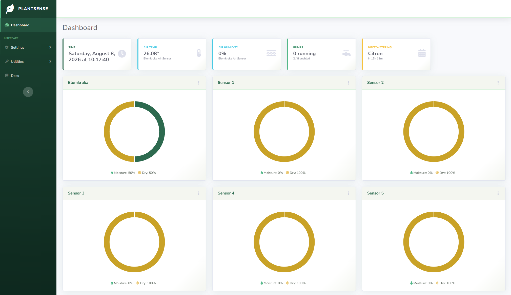

*Dashboard — live moisture per sensor, air readings, pump status, and next watering at a glance.*

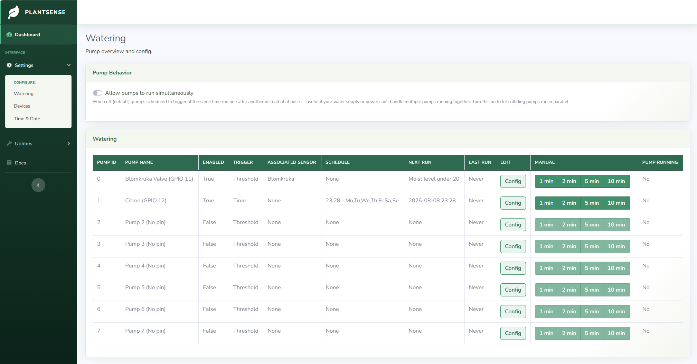

*Watering — per-pump configuration, trigger type, schedule, and manual controls, plus the simultaneous-pumps toggle.*

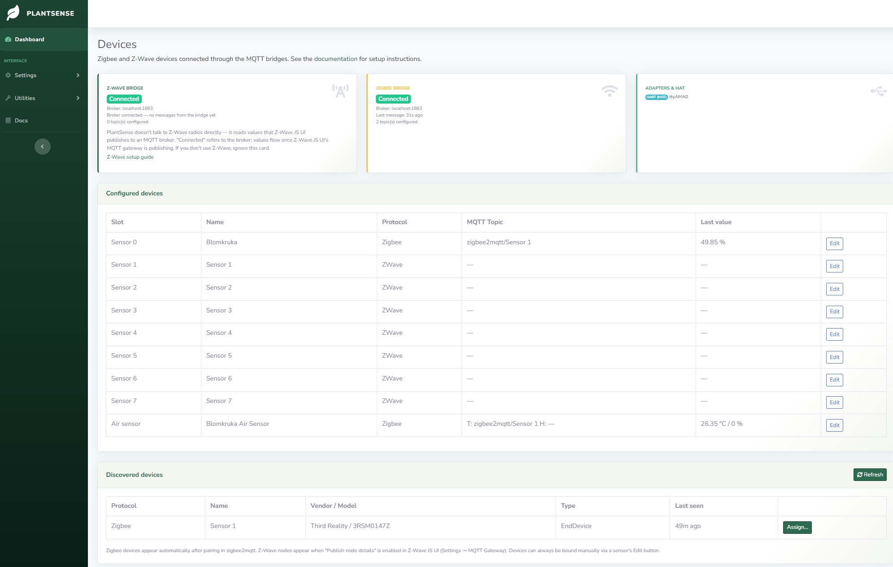

*Devices — bridge connection status, adapter detection, and configured/discovered sensor bindings.*

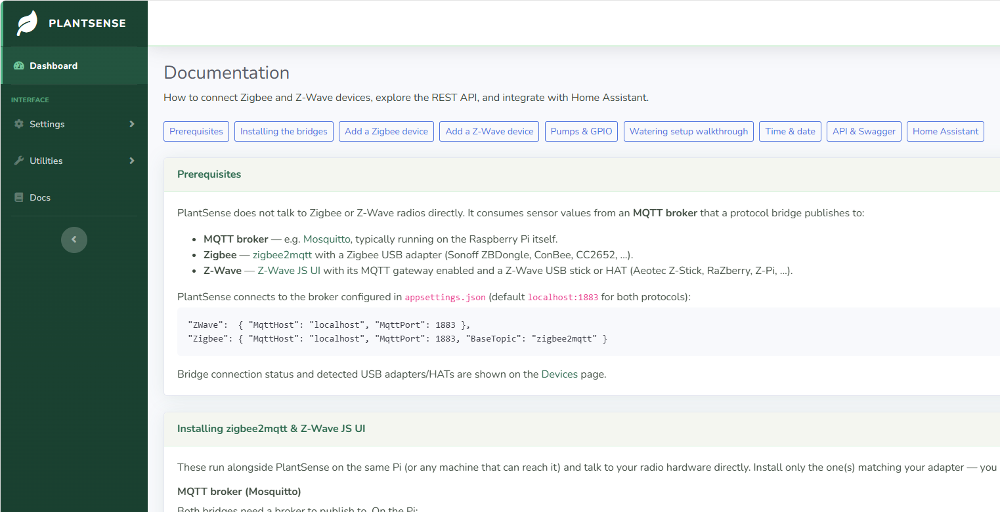

*Docs — built-in setup guide covering the MQTT bridges, device pairing, GPIO wiring, the REST API, and Home Assistant integration.*

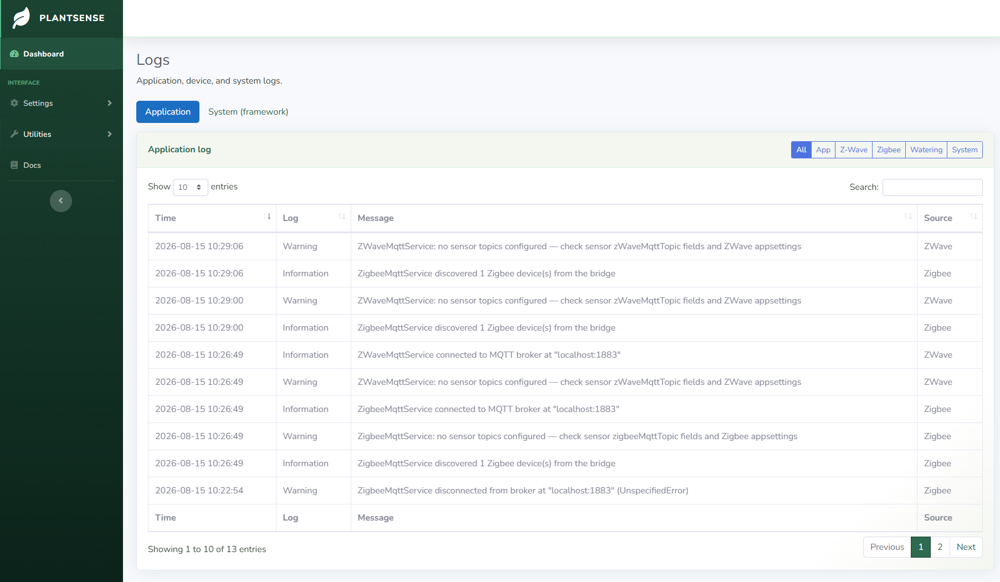

*Logs — structured, filterable application and system logs, viewable in-app without SSHing in.*

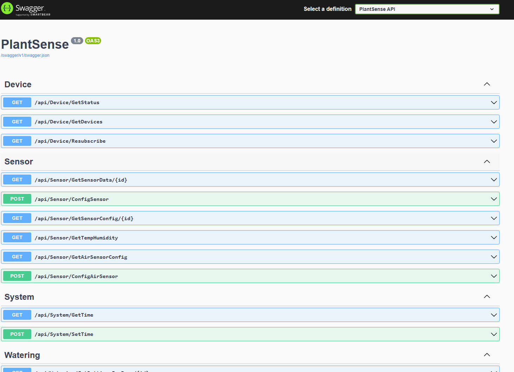

*Swagger — the full REST API, documented and callable directly from the browser at /swagger.*

All pages are also fully usable on a phone — stat tiles reflow to a 2-column grid, the pump table collapses into labeled stacked cards, and buttons/inputs are sized for one-handed tapping:

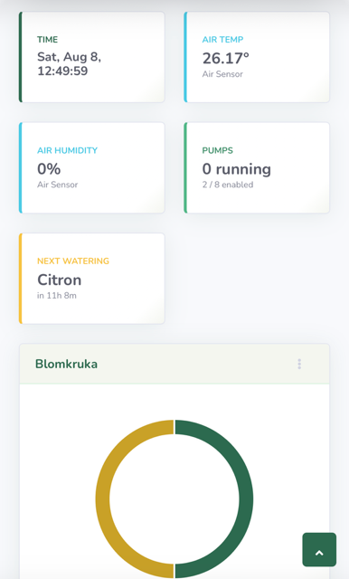 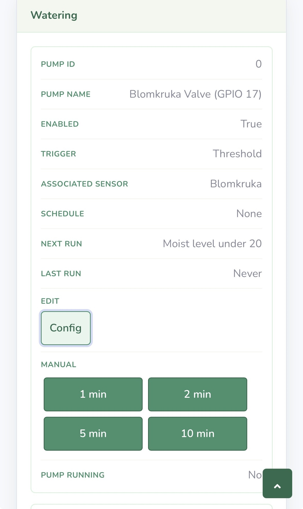

*Mobile view — dashboard tiles reflow to fit, and the watering table becomes a stacked, labeled card per pump.*


## Features

- **8 soil moisture sensors** — Zigbee or Z-Wave (mix freely), plus an optional air temperature/humidity sensor
- **8 water pumps** on GPIO pins via a relay board, with trigger modes: moisture threshold, weekly schedule, or manual
- **Web dashboard** — live moisture tiles, air readings, pump status, next watering countdown
- **Devices page** — bridge connection status, USB adapter/HAT detection, automatic device discovery and assignment
- **REST API & Swagger** — full control and monitoring; integrates with Home Assistant
- **Structured JSON logging** — viewable in-app at `/Logging`
- **Built-in documentation** — `/Docs` page with setup guides and troubleshooting

## How it works

PlantSense runs as one service on the Pi and drives each pump through a relay board wired to its GPIO pins. A background job checks every enabled pump once a minute and decides whether to run it, based on whatever trigger that pump is set to:

- **Threshold** — run when the assigned soil sensor's moisture drops below a % you set
- **Time** — run on a weekly schedule, any day, any time
- **Manual** — run only when told to, from the dashboard, the manual buttons, or a REST API call

That same REST API is also how external automations — Home Assistant or anything else that can make an HTTP call — can start or stop a pump directly, independent of PlantSense's own triggers  
Pumps whose triggers fire in the same tick run one after another by default; this can be changed to run them simultaneously under **Settings → Watering → Pump Behavior**, if your relay board and power supply can handle it.

Everything above works with no sensors at all — Time and Manual triggers need nothing but the Pi, relay board, and pumps.  
The Threshold trigger is the one exception: it needs live moisture readings, which come in over MQTT rather than PlantSense talking to Zigbee/Z-Wave radios directly:

```
Zigbee sensors ──> zigbee2mqtt (or deCONZ) ──┐
                                             ├──> Mosquitto (MQTT) ──> PlantSense ──> GPIO relays ──> pumps
Z-Wave sensors ──> Z-Wave JS UI ─────────────┘                             │
                                                                           └──> Web UI + REST API
```

Each sensor reports through its protocol's bridge — zigbee2mqtt (or deCONZ) for Zigbee, Z-Wave JS UI for Z-Wave — which publishes readings to a local MQTT broker (Mosquitto), and PlantSense subscribes. Everything runs on your own network; nothing leaves the house.

## What you'll need

**For time-scheduled watering only** — no sensors, just water on a schedule — you need just the basics:

- **Raspberry Pi** (3, 4, or 5) running a 64-bit OS — Ubuntu Server 22.04+ (recommended) or Raspberry Pi OS "bookworm"/Debian 12 (on Pi 4/5)
- **Power supply** for the Pi and pumps — see [Suggested hardware](#suggested-hardware)
- **Relay board** — see [Suggested hardware](#suggested-hardware)
- **Pumps or solenoid valves** (12V) wired to the relay board
- **PC for building** (Windows, Mac, or Linux with the .NET 7 SDK) — or build directly on the Pi, see step 8 below

**To also water based on live soil moisture readings** (the Threshold trigger), you additionally need a way to get sensor data into MQTT:

- **Zigbee adapter** (e.g. Sonoff ZBDongle, ConBee II, RaspBee II HAT, or CC2652P2) and/or **Z-Wave stick/HAT** (e.g. Aeotec Z-Stick, RaZberry, Z-Pi 7)
- **Zigbee and/or Z-Wave soil moisture sensors** — any mix, auto-discovered

Without a Zigbee/Z-Wave adapter, PlantSense still runs fine — the Time and Manual triggers don't need any sensor hardware at all; you just won't be able to use the Threshold trigger.

## Suggested hardware

The following are the specific parts I have used. Equivalent components (same specs, different brands) are available from other retailers depending on your region.

**Relay board:** 4-channel, 12V, opto-isolated  
[Reläkort x4 12V opto-isolerat (Electrokit)](https://www.electrokit.com/relakort-x4-12v-opto-isolerat?gad_source=1&gad_campaignid=17338847491&gclid=EAIaIQobChMIp8am2MeMlgMVwhqiAx168SyvEAYYAiABEgKcB_D_BwE)

**Note:** This is a 4-channel board. PlantSense supports up to 8 pumps, so a full 8-pump setup requires two relay boards (or scale down to 4 pumps with one). Opto-isolation protects the Pi's GPIO from voltage spikes on the pump side.

**Power supply:** Mean Well RD-35A, dual-output (5V/4A + 12V/1A), 32W, enclosure-mount  
[Switchat nätaggregat 5V/12V 4A/1A Mean Well RD-35A (Electrokit)](https://www.electrokit.com/switchat-nataggregat-5v/12v-4a/1a-mean-well-rd-35a?gad_source=1&gad_campaignid=17338847491&gclid=EAIaIQobChMI-ajP68eMlgMVsxiiAx10rDPoEAQYASABEgIjCPD_BwE)

**Critical:** This single power supply has two rails — the 5V/4A output powers the Raspberry Pi, and the 12V/1A output powers the pumps and relay board. You do not need a separate power supply for each; this one device handles both. This is the recommended approach for reliability and simplicity.

**Water valve (alternative to pump):** 12V solenoid, normally closed  
[Ventil för vattenstyrning (12V) - Normalt stängd (Styrahem)](https://www.styrahem.se/p/385/styrahem-ventil-for-vattenstyrning-12v-normalt-stangd)

**When to use:** A solenoid valve is wired to a relay channel exactly like a pump, but it's controlled by mains water pressure instead of drawing from a reservoir. "Normally closed" means it blocks water flow when de-energized (fail-safe: power loss = no water). Use this if you have a mains water line feed; use a pump if you're drawing from a tank or reservoir. Both are GPIO-controlled identically in PlantSense.

## Setup walkthrough

### 1. Prepare the Raspberry Pi OS

If using a RaspBee II (Zigbee on UART) or Z-Wave HAT:

```bash
sudo raspi-config
# Navigate to: Interface Options → Serial Port
# Answer: Login shell over serial → NO
#         Serial hardware enabled → YES
# Then reboot: sudo reboot
```

Also ensure your user can access GPIO and serial devices without sudo:

```bash
sudo usermod -aG gpio,dialout $USER
# Log out and back in for group membership to take effect
```

### 2. Install the MQTT broker (Mosquitto)

Both Zigbee and Z-Wave bridges publish to an MQTT broker:

```bash
sudo apt update
sudo apt install -y mosquitto mosquitto-clients
sudo systemctl enable --now mosquitto
```

Verify it's running:
```bash
mosquitto_sub -h localhost -t '#' -v
# Should connect and wait for messages. Press Ctrl+C.
```

### 3. Install Node.js (required for both bridges)

Install Node.js 22 LTS via the official repository:

```bash
curl -fsSL https://deb.nodesource.com/setup_22.x | sudo -E bash -
sudo apt install -y nodejs git make g++ gcc
node -v   # should print v22.x
```

**Troubleshooting Node.js installation:**
- If `node -v` shows the wrong version, check `type -a node` — another installation (nvm, snap, manual) may be shadowing it. Run `hash -r` to clear the cache and try again.
- If `apt-cache policy nodejs` shows priority 100 (installed out-of-band), you may need to force-downgrade:
  ```bash
  curl -fsSL https://deb.nodesource.com/setup_22.x | sudo -E bash -
  sudo apt update
  NODEVER=$(apt-cache madison nodejs | awk '/node_22\.x/{print $3; exit}')
  sudo apt install --allow-downgrades -y nodejs=$NODEVER
  ```

### 4. Install Zigbee bridge (if using Zigbee sensors)

**[Full guide](https://www.zigbee2mqtt.io/guide/installation/)**

```bash
# Clone the repo and install dependencies
sudo git clone --depth 1 https://github.com/Koenkk/zigbee2mqtt.git /opt/zigbee2mqtt
sudo chown -R $USER: /opt/zigbee2mqtt
cd /opt/zigbee2mqtt
npm install
sudo npm install -g pnpm   # Required for zigbee2mqtt's own self-build
cp data/configuration.example.yaml data/configuration.yaml
```

**Critical: Install pnpm.** zigbee2mqtt's source-only install (from git clone) requires `pnpm` to build on first start. If you skip this, you'll see `pnpm: not found` on first startup.

Edit `/opt/zigbee2mqtt/data/configuration.yaml` to match your hardware:

```yaml
mqtt:
  server: mqtt://localhost:1883

serial:
  port: /dev/ttyAMA0        # Change based on your adapter (see table below)
  adapter: deconz            # Change based on your adapter (see table below)

frontend:
  port: 8081                # Avoid conflict with PlantSense on 8080
```

**Adapter detection table:**

| Adapter / Chipset | Port | Adapter Type | Notes |
|---|---|---|---|
| RaspBee II (HAT) | `/dev/ttyAMA0` | `deconz` | GPIO UART; run raspi-config above first |
| ConBee II (HAT) | `/dev/ttyAMA0` | `deconz` | GPIO UART; run raspi-config above first |
| Sonoff ZBDongle-E (USB, Silicon Labs EFR32) | `/dev/serial/by-id/…` | `ember` | Find with: `ls /dev/serial/by-id/` |
| Sonoff ZBDongle-P (USB, Texas Instruments CC2652) | `/dev/serial/by-id/…` | `zstack` | Find with: `ls /dev/serial/by-id/` |
| ZiGate (USB) | `/dev/serial/by-id/…` | `zigate` | Find with: `ls /dev/serial/by-id/` |

Test startup (will trigger the build on first run):

```bash
npm start
# Wait for "Listening on 0.0.0.0:8081" — then press Ctrl+C
```

Run as a systemd service (replace `ubuntu` with your actual username):

```bash
sudo tee /etc/systemd/system/zigbee2mqtt.service > /dev/null <<'EOF'
[Unit]
Description=zigbee2mqtt
After=network-online.target
Wants=network-online.target

[Service]
WorkingDirectory=/opt/zigbee2mqtt
ExecStart=/usr/bin/npm start
StandardOutput=inherit
StandardError=inherit
Restart=on-failure
RestartSec=10s
User=ubuntu
Environment=NODE_ENV=production

[Install]
WantedBy=multi-user.target
EOF

sudo systemctl daemon-reload
sudo systemctl enable --now zigbee2mqtt
sudo systemctl status zigbee2mqtt   # Should show active (running)
```

Web UI for pairing: `http://<PI_IP>:8081`

### 5. Install Z-Wave bridge (if using Z-Wave sensors)

**[Full guide](https://zwave-js.github.io/zwave-js-ui/#/getting-started/quick-start)**

```bash
# If Node.js is already installed for Zigbee, skip to the clone
curl -fsSL https://deb.nodesource.com/setup_22.x | sudo -E bash -
sudo apt install -y nodejs git build-essential

git clone https://github.com/zwave-js/zwave-js-ui.git ~/zwave-js-ui
cd ~/zwave-js-ui
npm install
npm run build
```

Test startup:

```bash
npm start
# Wait for "Z-Wave JS UI listening on …" — then press Ctrl+C
```

Run as a systemd service (replace `ubuntu` with your actual username):

```bash
sudo tee /etc/systemd/system/zwave-js-ui.service > /dev/null <<'EOF'
[Unit]
Description=Z-Wave JS UI
After=network-online.target
Wants=network-online.target

[Service]
WorkingDirectory=/home/ubuntu/zwave-js-ui
ExecStart=/usr/bin/npm start
StandardOutput=inherit
StandardError=inherit
Restart=on-failure
RestartSec=10s
User=ubuntu
Environment=NODE_ENV=production

[Install]
WantedBy=multi-user.target
EOF

sudo systemctl daemon-reload
sudo systemctl enable --now zwave-js-ui
sudo systemctl status zwave-js-ui   # Should show active (running)
```

**Adapter detection table:**

| Adapter | Port | Notes |
|---|---|---|
| Aeotec Z-Pi 7 (HAT) | `/dev/ttyAMA0` | GPIO UART — same as RaspBee II; run the raspi-config step above first |
| RaZberry / RaZberry 7 (HAT) | `/dev/ttyAMA0` | GPIO UART — same as RaspBee II; run the raspi-config step above first |
| Aeotec Z-Stick (USB) | `/dev/serial/by-id/…` | Find with: `ls /dev/serial/by-id/` |
| Zooz ZST10/ZST39 (USB) | `/dev/serial/by-id/…` | Find with: `ls /dev/serial/by-id/` |

Unlike Zigbee, Z-Wave JS UI doesn't need a driver-type selection (no `deconz`/`ember`/`zstack` equivalent) — just point it at the right serial port.

Configure via its web UI at `http://<PI_IP>:8091`:
1. **Settings → Z-Wave** — add your device (port, e.g. `/dev/ttyAMA0` for a HAT or `/dev/ttyACM0` for most USB sticks)
2. **Settings → MQTT** — enable the gateway, point at `localhost:1883`

### 6. Install ASP.NET Core runtime

```bash
curl -sSL https://dot.net/v1/dotnet-install.sh | bash /dev/stdin --channel 7.0 --runtime aspnetcore
echo 'export DOTNET_ROOT=$HOME/.dotnet' >> ~/.profile
echo 'export PATH=$PATH:$HOME/.dotnet' >> ~/.profile
source ~/.profile
dotnet --version   # should print 7.x
```

### 7. Configure GPIO permissions

Allow the app user to drive GPIO without sudo:

```bash
sudo groupadd -f gpiouser
sudo usermod -a -G gpiouser $USER
sudo tee /etc/udev/rules.d/50-gpio.rules > /dev/null <<'EOF'
SUBSYSTEM=="gpio*", PROGRAM="/bin/sh -c '\
    chown -R root:gpiouser /sys/class/gpio && chmod -R 770 /sys/class/gpio;\
    chown -R root:gpiouser /sys/devices/virtual/gpio && chmod -R 770 /sys/devices/virtual/gpio;\
    chown -R root:gpiouser /sys$devpath && chmod -R 770 /sys$devpath\
'"
EOF
sudo udevadm control --reload-rules && sudo udevadm trigger
sudo reboot   # Required for group membership to take effect
```

### 8. Build and deploy PlantSense

**Option A: Build on a separate PC, deploy to the Pi (faster — cross-compiling avoids the Pi's limited CPU)**

On your Windows/Mac/Linux PC with the .NET 7 SDK:

```bash
git clone <this repo>
cd Plantsense/src/PlantSense

# Publish for the Pi
dotnet publish PlantSense.csproj -c Release -r linux-arm64 --self-contained false

# Deploy to Pi via scp (Windows 10+ has ssh/scp built-in)
scp -r bin/Release/net7.0/linux-arm64/publish/* <user>@<PI_IP>:/home/<user>/plantsense/
```

**Note:** Use `-r linux-arm` if your Pi runs a 32-bit OS. Check with `uname -m` on the Pi: `aarch64` = 64-bit, `armv7l` = 32-bit.

**Option B: Build directly on the Pi (no second machine needed)**

The Pi needs the full .NET 7 **SDK** for this (not just the runtime from step 6 — the SDK includes it, so you can skip step 6 if you're going this route):

```bash
curl -sSL https://dot.net/v1/dotnet-install.sh | bash /dev/stdin --channel 7.0
echo 'export DOTNET_ROOT=$HOME/.dotnet' >> ~/.profile
echo 'export PATH=$PATH:$HOME/.dotnet' >> ~/.profile
source ~/.profile
dotnet --version   # should print 7.x
```

Then clone and publish natively — no `-r`/RID needed since you're already building for the Pi's own architecture:

```bash
git clone <this repo> ~/plantsense-src
cd ~/plantsense-src/src/PlantSense
dotnet publish PlantSense.csproj -c Release --self-contained false -o /home/<user>/plantsense
```

This is noticeably slower than cross-compiling on a PC (expect a few minutes on a Pi 4/5, longer on a Pi 3), but it's a fully self-contained workflow if you'd rather not set up a build machine at all. The `-o` output path can point straight at the directory you'll run the service from — skip the `scp` step from Option A since the build already landed in place.

### 9. Run as a systemd service (autostart)

On the Pi, create `/etc/systemd/system/plantsense.service` (replace `ubuntu` with your actual username):

```ini
[Unit]
Description=PlantSense
After=network-online.target
Wants=network-online.target

[Service]
WorkingDirectory=/home/ubuntu/plantsense
ExecStart=/home/ubuntu/.dotnet/dotnet /home/ubuntu/plantsense/PlantSense.dll --urls "http://*:8080"
Restart=always
RestartSec=10
KillSignal=SIGINT
SyslogIdentifier=dotnet-plantsense
User=ubuntu
Environment=ASPNETCORE_ENVIRONMENT=Production

[Install]
WantedBy=multi-user.target
```

**Important:** Replace `ubuntu` in **both** `User=` and the path `/home/ubuntu/` with your actual username. If the username is wrong, the service will fail with status code 217 (USER not found).

Enable and start:

```bash
sudo systemctl daemon-reload
sudo systemctl enable --now plantsense.service
sudo systemctl status plantsense.service
sudo journalctl -u plantsense.service -f   # Follow logs in real-time
```

Open `http://<PI_IP>:8080` — you should see the dashboard. All settings are stored in `plantsettings.json` next to the app (created automatically on first run).

**Optional:** Allow passwordless sudo for time/date changes via the UI:
```bash
echo 'ubuntu ALL=(ALL) NOPASSWD: /usr/bin/timedatectl' | sudo tee /etc/sudoers.d/plantsense-time
```

## Adding sensors and devices

1. **Pair the sensor** with its bridge:
   - **Zigbee:** Open zigbee2mqtt at `http://<PI_IP>:8081`, enable "Permit join", put the sensor in pairing mode (usually button-hold), give it a friendly name
   - **Z-Wave:** In Z-Wave JS UI at `http://<PI_IP>:8091`, go to Control Panel → Manage nodes → Inclusion, then put the sensor in inclusion mode

2. **Assign in PlantSense:**
   - Open **Settings → Devices**
   - Paired devices appear under "Discovered devices"
   - Click **Assign…** to pick a sensor slot (0–7) or the air-sensor role

3. **Verify:** The dashboard should show live readings within 30 seconds

**Manual binding (fallback):** If auto-discovery doesn't work, open a sensor's settings and enter the MQTT topic directly:
- Zigbee: `zigbee2mqtt/Sensor Name` (JSON payload parsed automatically, or `zigbee2mqtt/Sensor Name/value` for single properties)
- Z-Wave: Find the value topic in Z-Wave JS UI (Control Panel → node → Values), e.g. `zwave/Node7/sensorMultilevel/Soil moisture/value`

Topic changes take effect immediately — no app restart needed.

## Configuring pumps

### Basic setup

1. Open **Settings → Watering**
2. Select a pump and enable it
3. Set its **GPIO pin** (BCM numbering) and **Runtime** (seconds to run)
4. Choose a **trigger**:
   - **Sensor Threshold** — pump runs when the assigned sensor's moisture drops below its threshold %
   - **Time** — weekly schedule, any time of day
   - **Manual** — only run via UI/API buttons

### Trigger modes explained

**Sensor Threshold:**
- Sensor's moisture threshold is set on the sensor itself (Dashboard or Devices page)
- Pump's job is to react when moisture drops below that threshold
- Evaluated every minute (when enabled)

**Time:**
- Pick any days of the week and a time (free `HH:mm` picker, evaluated every minute)
- Pump runs for its configured runtime on that schedule

**Manual:**
- Only control via UI buttons or API calls

### Pump Behavior: concurrency

**Settings → Watering → Pump Behavior** controls what happens when multiple pump schedules overlap:
- **Queued (default)** — pumps run one after another, serialized (safer for power/water pressure)
- **Concurrent** — pumps run simultaneously via Task.WhenAll (requires adequate relay power and water supply)

### GPIO pin mapping

PlantSense assigns GPIO pins per pump — no fixed mapping — but which pins are actually free depends on whether you have a RaspBee II (Zigbee) or Z-Pi 7 (Z-Wave) HAT seated, since both physically occupy the low end of the 40-pin header (not just the pins they electrically use). **The same 8 pins work safely with either HAT** (or with no HAT at all, e.g. a USB adapter):

**BCM 27, 22, 23, 24, 25, 16, 20, 26** — exactly enough for all 8 pumps.

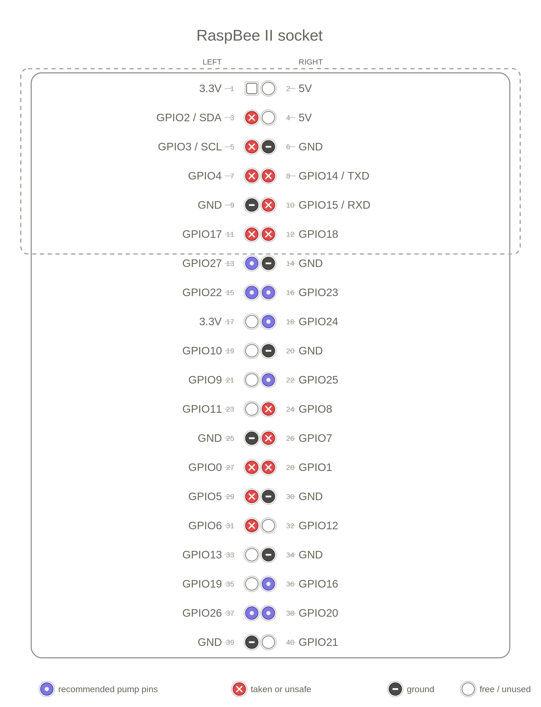

*With RaspBee II installed — its socket covers physical pins 1–12 (GPIO 2, 3, 4, 14, 15, 17, 18 among them), so those aren't accessible for wiring even though RaspBee II only electrically uses a few of them.*

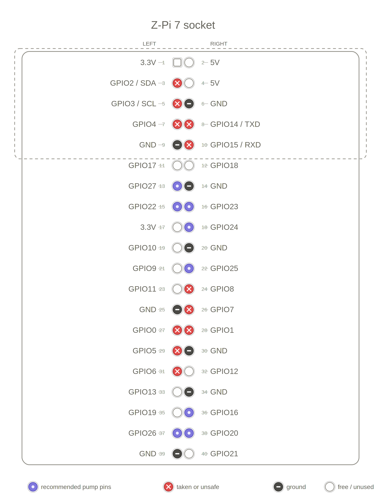

*With Z-Pi 7 installed — its socket is smaller, covering physical pins 1–10 (3V3, GPIO2, GPIO3, GPIO4, GND, GPIO14, GPIO15 among them). Notably GPIO 17/18 are free here, unlike with RaspBee II — but since neither is in the recommended set anyway, the same 8 pump pins apply either way.*

If you're not using either HAT (e.g. a USB Zigbee/Z-Wave dongle instead), the full header is available and the same 8 pins are still a safe, conflict-free choice — just avoid:
- GPIO 0/1 — HAT ID EEPROM
- GPIO 2/3 — I2C
- GPIO 5/6 — reserved
- GPIO 7–11 — SPI0 (CE1, CE0, MISO, MOSI, SCLK)
- GPIO 14/15 — UART

### Wiring

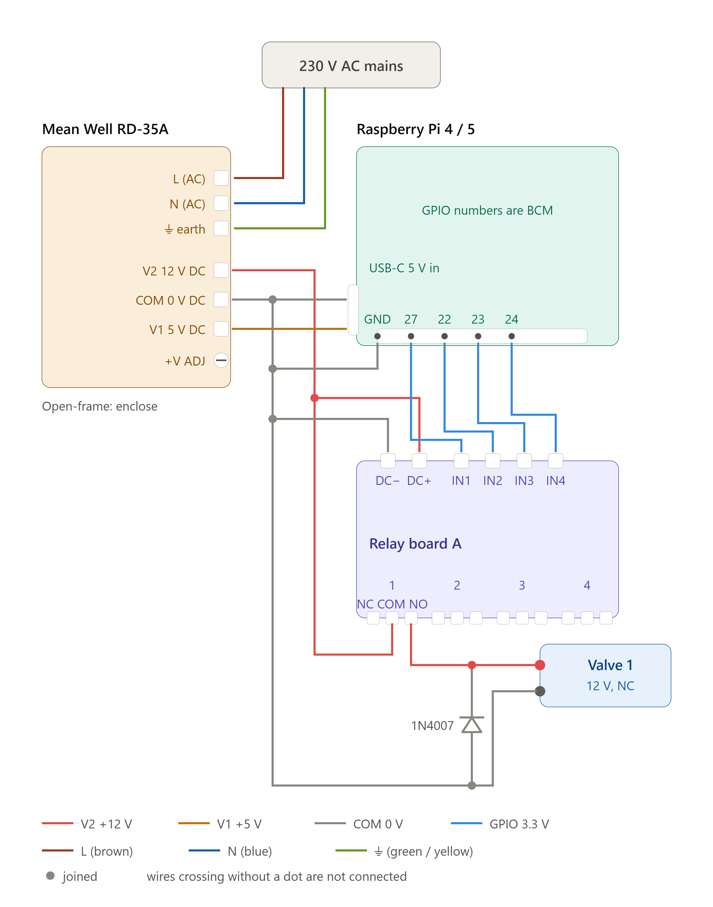

*One pump/valve channel shown — repeat the relay-to-load wiring for each additional pump, connecting a second relay board in parallel (shared 12V and GND, separate GPIO per channel) once you go past 4.*

- Connect each relay channel's input (IN1–IN4 per board) to a free GPIO pin on the Pi (GPIO 27, 22, 23, 24 shown above for the first board's four channels)
- **Power distribution:** a dual-output power supply (e.g. Mean Well RD-35A) drives both rails from one unit:
  - **V1 5V DC** → Raspberry Pi power input (USB-C on Pi 4/5, micro-USB on Pi 3)
  - **V2 12V DC** → relay board's DC+ / DC−, and through each relay's COM/NO contacts to the pump or valve — never power pumps from the Pi's own 5V
- **Share ground/COM** between the Pi, relay board, power supply, and pump/valve return wire — everything ties back to the same 0V reference
- **Flyback diode (optional):** a diode like the 1N4007 shown across the valve's terminals in the diagram isn't required — most relay boards already have one built in per channel, and many valves/pumps tolerate switching fine without it. It's still worth adding one directly across a solenoid valve's own terminals if you have a spare: when the coil de-energizes, its magnetic field collapses and briefly pushes current backward, and that spike can shorten the relay contacts' lifespan over many cycles. The diode just gives that current somewhere safe to go (cathode to the +12V side) instead of arcing across the relay contact. Cheap insurance, not a requirement.
- If using 4-channel relay boards and need more than 4 pumps, connect a second relay board in parallel (same 12V and GND, different GPIO pins for control)

## Dashboard

The dashboard shows:

- **Time** — current device time (set via Settings → Time & Date)
- **Air Temp / Air Humidity** — from the air sensor (if configured), with its user-given name
- **Pumps** — count of running pumps / enabled pumps
- **Next Watering** — soonest scheduled watering + countdown timer
- **Moisture cards** — per sensor, doughnut chart showing "Moisture: X%" and "Dry: Y%"

Click any sensor card to configure its name, threshold, and MQTT topic.

## REST API

Interactive documentation at `/swagger`. All endpoints are unauthenticated — keep the Pi on your local network.

| Endpoint | Description |
|---|---|
| `GET /api/Watering/ManualPump/{id}?runtime={sec}` | Run pump 0–7 for N seconds |
| `GET /api/Watering/StartPump/{id}` | Run pump using its configured runtime |
| `GET /api/Watering/StopPump/{id}` | Stop pump immediately |
| `GET /api/Watering/IsPumpRunning/{id}` | `true` / `false` |
| `GET /api/Watering/GetPumpStatusSummary` | All pumps' status (running, enabled, next scheduled run) |
| `GET /api/Sensor/GetSensorData/{id}` | Moisture reading for sensor 0–7 (includes `moisture` and `dryness` %) |
| `GET /api/Sensor/GetTempHumidity` | Air temperature and humidity |
| `GET /api/Device/GetStatus` | Bridge/adapter status and detected hardware |

## Home Assistant integration

Use Home Assistant's built-in `rest` and `rest_command` integrations — no custom component needed.

Add to `configuration.yaml` (replace `<PI_IP>`):

```yaml
rest_command:
  plantsense_pump0_2min:
    url: "http://<PI_IP>:8080/api/Watering/ManualPump/0?runtime=120"
    method: GET
  plantsense_pump0_stop:
    url: "http://<PI_IP>:8080/api/Watering/StopPump/0"
    method: GET

sensor:
  - platform: rest
    name: "PlantSense Pump 0 Running"
    unique_id: plantsense_pump0_running
    resource: "http://<PI_IP>:8080/api/Watering/IsPumpRunning/0"
    value_template: "{{ value_json }}"
    scan_interval: 15

  - platform: rest
    name: "PlantSense Moisture 0"
    unique_id: plantsense_moisture_0
    resource: "http://<PI_IP>:8080/api/Sensor/GetSensorData/0"
    value_template: "{{ value_json.moisture }}"
    unit_of_measurement: "%"
    device_class: moisture
    state_class: measurement
    scan_interval: 60

automation:
  - alias: "Water when moisture is low"
    trigger:
      - platform: numeric_state
        entity_id: sensor.plantsense_moisture_0
        below: 35
    condition:
      - condition: state
        entity_id: sensor.plantsense_pump0_running
        state: "false"
    action:
      - service: rest_command.plantsense_pump0_2min
```

**Three automation approaches (mix per pump):**

1. **PlantSense threshold** — sensor threshold % on Dashboard, pump trigger on Watering page, fully autonomous
2. **PlantSense schedule** — weekly days/time on Watering page, no external dependency
3. **Home Assistant automation** — call pump API on any HA trigger (moisture, time, weather, presence, etc.)

See `/Docs` in the app for full Home Assistant examples and templates.

## Building on Windows/Mac/Linux (no Visual Studio required)

```bash
# Install .NET 7 SDK
# Windows: winget install Microsoft.DotNet.SDK.7
# macOS: curl -sSL https://dot.net/v1/dotnet-install.sh | bash /dev/stdin --channel 7.0
# Linux: same as macOS

git clone <this repo>
cd Plantsense/src/PlantSense

# Publish for the Pi
dotnet publish PlantSense.csproj -c Release -r linux-arm64 --self-contained false

# Binaries land in: bin/Release/net7.0/linux-arm64/publish/
```

Any text editor works; [VS Code](https://code.visualstudio.com/) with the C# Dev Kit extension is free and recommended.

## Development (local testing)

```bash
cd src/PlantSense
dotnet run
```

Local URLs: `https://localhost:5001` (Swagger at `/swagger`).

Runs fine on Windows/Mac for UI and MQTT work — GPIO endpoints return errors off the Pi (no GPIO hardware). Tip: run a local Mosquitto and publish test payloads with `mosquitto_pub` to simulate sensors.

Example:
```bash
# In another terminal, simulate a Zigbee soil sensor
mosquitto_pub -t zigbee2mqtt/Sensor1 -m '{"soil_moisture": 45}'
```

## Troubleshooting

**Sensors show "—" (no reading):**
- Check **Settings → Devices** — both bridge cards should say "Connected"
- Verify Mosquitto is running: `systemctl status mosquitto`
- Check if the bridge is publishing: `mosquitto_sub -t 'zigbee2mqtt/#' -v` (Zigbee) or `mosquitto_sub -t 'zwave/#' -v` (Z-Wave)
- Confirm the sensor's MQTT topic matches exactly — case-sensitive
- **For Zigbee:** Pair the sensor in zigbee2mqtt and give it a friendly name. Check the Devices page's "Discovered devices" tab
- **For Z-Wave:** Enable "Publish node details" in Z-Wave JS UI settings (Settings → MQTT Gateway)

**Pumps don't run:**
- Verify the pump is **enabled** with a nonzero runtime and correct GPIO pin
- Check the trigger type and associated sensor (Threshold) or schedule (Time)
- Review logs: `journalctl -u plantsense.service` for GPIO permission errors — redo the udev rules section and reboot if present
- Verify the relay board is powered and the pump physically works (test with GPIO on/off manually)

**"pnpm: not found" when starting zigbee2mqtt:**
- You skipped `npm install -g pnpm` in the Zigbee setup. Run it now: `sudo npm install -g pnpm`
- Then restart: `sudo systemctl restart zigbee2mqtt`

**Node version mismatch (EBADENGINE during npm install):**
- Check `node -v` — should be 22.x or newer (verify against zigbee2mqtt's `package.json`)
- Multiple Node installations may exist. Run `type -a node` to list them all
- Consider using the nodesource APT package (recommended) rather than nvm, since systemd services don't source shell rc files

**Z-Wave JS UI or zigbee2mqtt service fails (status 217/USER):**
- Verify the `User=` line in the systemd unit matches your actual username
- Verify the `WorkingDirectory` path exists and is readable by that user
- Check the logs: `journalctl -u zwave-js-ui.service`

**App won't start:**
- Run it manually to see the error: `cd ~/plantsense && ~/.dotnet/dotnet PlantSense.dll --urls "http://*:8080"`
- Check that port 8080 is free: `sudo netstat -tulpn | grep 8080`

**Dashboard unreachable:**
- Verify the service is running: `sudo systemctl status plantsense.service`
- Check logs: `sudo journalctl -u plantsense.service -n 50`
- Verify port 8080 is open: `curl http://localhost:8080` on the Pi itself

**Sensor readings stuck at 0% or "—" after startup:**
- PlantSense starts with "no reading yet" instead of a phantom 0% to avoid false pump triggers while MQTT messages arrive
- This clears once the bridge publishes its first value (usually within 30 seconds)

## Docs

For deeper guides (protocol setup, Home Assistant templates, debugging MQTT), see the `/Docs` page in the running app at `http://<PI_IP>:8080/Docs`.

---

**License:** [MIT](LICENSE) — free to use, modify, and redistribute.

**Credits:** This project integrates Zigbee2MQTT, Z-Wave JS UI, MQTTnet, and Serilog. See `src/PlantSense/wwwroot/` for bundled third-party licenses.
